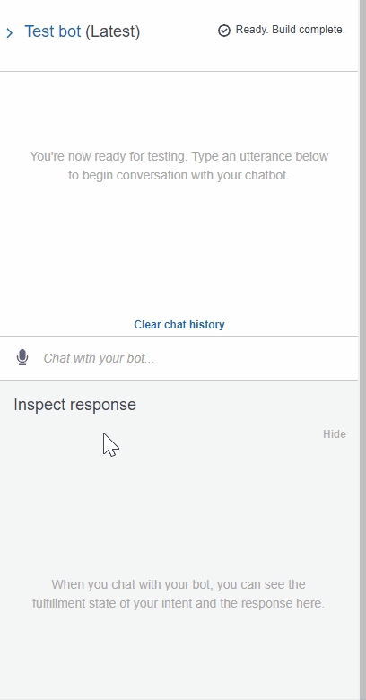

# unit13-challenge
Creating a RoboAdvisor using Amazon Lex and Amazon Lambda

In this homework, I configured a Roboadvisor using an Amazon Lex chatbot that provides an investment allocation recommendation for retirement. To enhance the chatbot, I created an Amazon Lambda Function that validates the user's inputs (age and invesetment amount) and gives out an investment recommendation based on the user's risk level. 

The user must have the following inputs:
- age must not be greater than 65 years old
- investment amount must be at least $5000

The GIF below shows how the roboadviser chatbot works. I also used some test cases with non qualified user inputs (age >65 or investment <5000) to show how the roboadviser responds. 

Here are the relevant files:

- [Lambda Function in Python](http://) 
- [Robo Advisor zip file from Amazon Lex](http://) 

